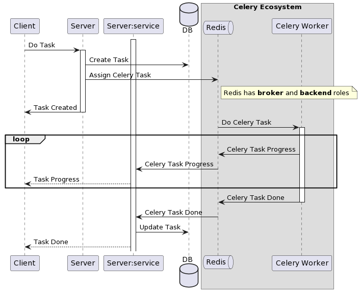

# FastAPI + PostgresSQL + Celery Example

An example microservices demonstrates how to perform heavy background computation task such as running machine learning model.

Tech stack:

- FastAPI
  - create task
  - query task
- PostgresSQL
  - persist task
- Celery
  - Redis: as broker and backend of celery

Workflow:



_NOTE_:

- `Task` is for frontend user. Its schemas are defined by custom FastAPI `App`
- `Celery Task` is for internal celery-related services and used by the backend. Its schemas are fixed and defined by `Celery`, seeing [Task](https://docs.celeryq.dev/en/latest/internals/reference/celery.backends.database.models.html#celery.backends.database.models)

## Get Started

```sh
docker run -it --rm fastapi-celery-web bash
```

```sh
docker exec -it fastapi-celery-db-1 bash
```

```sh
docker-compose build
# CTRL+C: just stop containers while keeping data
docker-compose up
docker-compose up -d

# Remove containers with wiping data
docker-compose down 
```

_NOTE_:

- `Dockerfile.dev` is used for developing easily in container environment. All `docker compose files` here are for development.
